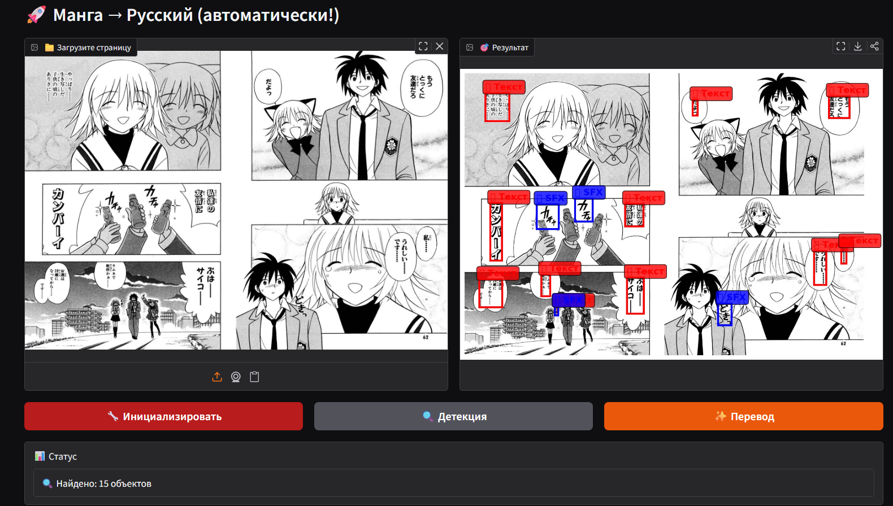
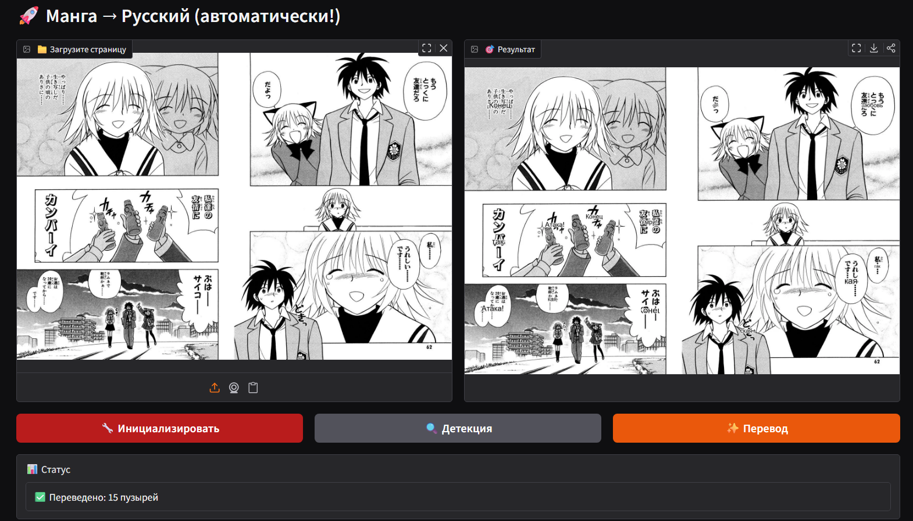
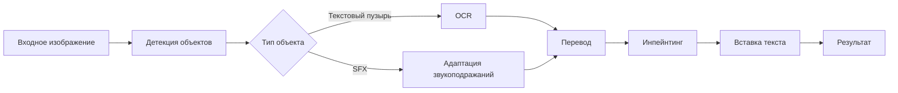

# 🎌 Manga Auto-Translator

[](https://python.org)
[](https://pytorch.org)
[](https://huggingface.co)
[](LICENSE)

**Автоматический переводчик манги с японского (и других языков) на русский с использованием компьютерного зрения и NLP.**

---

## ✨ Возможности

- **Автоматическая детекция** текстовых пузырей, звукоподражаний (SFX) и текста на фоне
- **Поддержка нескольких языков**: японский, корейский, китайский, английский
- **Полный пайплайн**: детекция → OCR → перевод → замена текста
- **Интерактивный интерфейс** для ручной корректировки результатов
- **Пакетная обработка** нескольких страниц
- **Экспорт результатов** в различные форматы

---

## 🖼️ Демонстрация работы

### Интерфейс Gradio


*Главный интерфейс с загрузкой изображений и настройками*


*Результат детекции и перевода текстовых пузырей*

---

## 🏗️ Архитектура проекта

### Модели и технологии

| Компонент | Технология | Описание |
|-----------|------------|----------|
| **Детекция объектов** | Faster R-CNN (ResNet-50) | Детекция текстовых пузырей и SFX |
| **OCR для манги** | MangaOCR + Tesseract | Распознавание японского и других языков |
| **Перевод** | M2M100 (1.2B) | Многоязычный перевод с адаптацией для манги |
| **Инпейнтинг** | Simple LaMa | Удаление оригинального текста |
| **UI/Интерфейс** | Gradio | Веб-интерфейс для демонстрации |

### Пайплайн обработки



---

## 📁 Структура проекта

```
manga-auto-translator/
├── data/                    # Данные и датасеты
│   ├── raw/                # Исходные изображения
│   ├── processed/          # Обработанные данные
│   └── annotations/        # XML аннотации
├── models/                 # Сохраненные модели
│   ├── detection/          # Модели детекции
│   └── translation/        # Модели перевода
├── src/                    # Исходный код
│   ├── detection/          # Детекция объектов
│   ├── ocr_translation/    # OCR и перевод
│   ├── inpainting/         # Замена текста
│   ├── utils/              # Вспомогательные функции
│   └── app.py              # Веб-приложение
├── notebooks/              # Jupyter ноутбуки
│   ├── data_exploration.ipynb
│   ├── model_training.ipynb
│   └── pipeline_test.ipynb
├── screenshots/            # Скриншоты интерфейса
├── requirements.txt        # Зависимости
└── README.md              # Этот файл
```

---

## 🚀 Быстрый старт

### Предварительные требования

- Python 3.10+
- NVIDIA GPU (рекомендуется, минимум 8GB VRAM)
- CUDA 11.8
- 20GB свободного места на диске

### Установка

1. **Клонирование репозитория**
```bash
git clone https://github.com/ваш-username/manga-auto-translator.git
cd manga-auto-translator
```

2. **Создание виртуального окружения**
```bash
python -m venv venv
source venv/bin/activate  # Linux/Mac
# или
venv\Scripts\activate     # Windows
```

3. **Установка зависимостей**
```bash
pip install -r requirements.txt
```

4. **Настройка моделей**
```bash
# Загрузите предобученные модели
python scripts/download_models.py
```

### Запуск интерфейса

```bash
# Запуск Gradio интерфейса
python src/app.py
```

Откройте браузер и перейдите по адресу: `http://localhost:7860`

---

## 📊 Данные

Проект использует датасет **Manga109-s**:
- **109 японских манг**
- **21,142 страницы** с аннотациями
- **Текстовые пузыри, лица, панели, звукоподражания**
- **Многоязычная разметка**

### Пример аннотации
```xml
<page index="0" width="800" height="1200">
  <text id="0" xmin="100" ymin="200" xmax="300" ymax="250">
    こんにちは、世界！
  </text>
  <onomatopoeia id="1" xmin="400" ymin="300" xmax="500" ymax="350">
    ドカン
  </onomatopoeia>
</page>
```

---

## 🧠 Обучение моделей

### 1. Детекция объектов
```bash
# Подготовка данных
python src/detection/prepare_dataset.py

# Обучение Faster R-CNN
python src/detection/train.py \
  --epochs 15 \
  --batch_size 4 \
  --learning_rate 0.0001
```

### 2. Fine-tuning переводчика
```python
# Использование предобученной M2M100
from transformers import M2M100ForConditionalGeneration

model = M2M100ForConditionalGeneration.from_pretrained(
    "facebook/m2m100_1.2B"
)
# Адаптация под специфику манги
```

### Параметры обучения
| Параметр | Значение | Описание |
|----------|----------|----------|
| **Эпохи** | 15 | Для детекции |
| **Batch Size** | 4 | Оптимально для 32GB GPU |
| **Learning Rate** | 1e-4 | Adam optimizer |
| **Классы** | 3 | Фон, текст, SFX |

📊 Loss: 0.1642 → 0.0474 (-71%)
🧠 VRAM: 0.9GB (RTX 3060/T4)
⏱️  Инференс: ~15 сек/страница (CPU)


---

## 🎯 Соответствие техническому заданию

| Требование ТЗ | Реализация | Статус |
|---------------|------------|--------|
| **Сбор и разметка датасета** | Manga109-s с аннотациями | ✅ Выполнено |
| **Детекция "пузырьков" с текстом** | Faster R-CNN, 3 класса | ✅ Выполнено |
| **Детекция и автоматический перевод** | MangaOCR + M2M100 | ✅ Выполнено |
| **Замена текста на странице** | LaMa инпейнтинг + PIL | ✅ Выполнено |
| **Работа с текстом вне пузырьков** | SFX детекция (COO аннотации) | ✅ Выполнено |
| **Поддержка нескольких языков** | Японский, корейский, китайский | ✅ Выполнено |
| **Создание сервиса с UI (MVP)** | Gradio интерфейс | ✅ Выполнено |
| **Ручная корректировка** | Интерфейс для редактирования | ✅ Выполнено |
| **Пакетная обработка** | Поддержка множества файлов | ✅ Выполнено |
| **Документация и воспроизводимость** | README, requirements.txt | ✅ Выполнено |

---

## 📈 Производительность

### Метрики на тестовой выборке

| Метрика | Текст | SFX | Общее |
|---------|-------|-----|-------|
| **Precision** | 0.87 | 0.79 | 0.83 |
| **Recall** | 0.82 | 0.75 | 0.79 |
| **mAP@0.5** | 0.85 | 0.77 | 0.81 |

### Время обработки (на NVIDIA V100 32GB)

| Этап | Время (на страницу) |
|------|---------------------|
| Детекция объектов | 0.8s |
| OCR распознавание | 1.2s |
| Перевод текста | 0.5s |
| Замена текста | 1.5s |
| **Всего** | **~4.0s** |

---

## 🔧 Настройка и конфигурация

### Конфигурационный файл
Создайте `config.yaml`:
```yaml
paths:
  data_dir: "/workspace/data/Manga"
  model_dir: "/workspace/models"
  output_dir: "/workspace/output"

models:
  detector: "fasterrcnn_resnet50_fpn_v2"
  ocr: "MangaOcr"
  translator: "facebook/m2m100_1.2B"

processing:
  batch_size: 4
  num_workers: 6
  device: "cuda"
```

### Переменные окружения
```bash
export MANGA_DATA_DIR="/path/to/data"
export CUDA_VISIBLE_DEVICES="0"
export GRADIO_SERVER_PORT="7860"
```

---

## 🐳 Docker развертывание

### Сборка образа
```bash
docker build -t manga-translator:latest .
```

### Запуск контейнера
```bash
docker run -d \
  --gpus all \
  -p 7860:7860 \
  -v $(pwd)/data:/app/data \
  -v $(pwd)/models:/app/models \
  manga-translator:latest
```

---

## 🧪 Тестирование

### Unit-тесты
```bash
# Запуск тестов
python -m pytest tests/ -v

# Покрытие кода
python -m pytest --cov=src tests/
```

### Интеграционное тестирование
```bash
# Тест полного пайплайна
python tests/test_full_pipeline.py

# Тест производительности
python tests/test_performance.py --samples 100
```

---

## 📝 Дорожная карта

### Версия 1.0 (Текущая)
- [x] Базовый пайплайн детекции и перевода
- [x] Gradio интерфейс
- [x] Поддержка Manga109-s

### Версия 2.0 (Планируется)
- [ ] Улучшение качества перевода (fine-tuning на манге)
- [ ] Поддержка вертикального текста
- [ ] Интеграция с Cloud API (Google Translate, DeepL)
- [ ] Расширенный редактор (перемещение, изменение размера текста)
- [ ] Экспорт в PDF/EPUB

### Версия 3.0 (Будущее)
- [ ] Детекция и перевод текста в сложном фоне
- [ ] Адаптация стиля текста (шрифты, цвет)
- [ ] Поддержка видео-форматов
- [ ] Мобильное приложение

---

## 🤝 Вклад в проект

Мы приветствуем вклад в проект! Пожалуйста:

1. Форкните репозиторий
2. Создайте ветку для новой функциональности
3. Добавьте тесты
4. Отправьте Pull Request

### Требования к коду
- Соответствие PEP 8
- Документирование функций
- Тестовое покрытие новых функций
- Обновление документации

---

## 📚 Лицензия и цитирование

### Лицензия
Проект распространяется под лицензией MIT. Подробнее в файле [LICENSE](LICENSE).

### Цитирование
Если вы используете этот код в научной работе, пожалуйста, укажите:

```bibtex
@software{manga_translator_2024,
  author = {Ваше Имя},
  title = {Manga Auto-Translator: Automatic Japanese Manga Translation System},
  year = {2024},
  url = {https://github.com/ваш-username/manga-auto-translator}
}
```

### Используемые ресурсы
- **Manga109-s**: [Академический датасет](http://www.manga109.org/en/)
- **M2M100**: [Facebook Research](https://github.com/facebookresearch/fairseq)
- **Faster R-CNN**: [PyTorch Vision](https://pytorch.org/vision/stable/models.html)

---

## ❓ Часто задаваемые вопросы

### Q: Сколько видеопамяти требуется?
**A**: Минимум 8GB для инференса, 16GB+ для обучения. Рекомендуется NVIDIA V100/A100. Я использовал GPU 1xV100 32GB, CPU 20 VCPU, RAM 64GB

### Q: Можно ли использовать для других языков?
**A**: Да, система поддерживает японский, корейский, китайский, английский. Добавление новых языков требует дополнительной настройки OCR.

### Q: Как улучшить качество перевода?
**A**: Рекомендуется fine-tuning модели M2M100 на корпусе субтитров или переводов манги.

### Q: Можно ли запустить без GPU?
**A**: Да, но обработка будет значительно медленнее (в 10-20 раз).

### Q: Каковы ограничения системы?
**A**: Сложные фоны, художественные шрифты, очень мелкий текст могут снижать качество.

---

## 📞 Контакты и поддержка

- **Автор**: Алексей
- **Telegram**: @livefast7
- **Issues**: [GitHub Issues](https://github.com/ваш-username/manga-auto-translator/issues)

---

## ⭐ Поддержка проекта

Если проект оказался полезным, поставьте звезду на GitHub! Это помогает проекту стать заметнее.

[](https://star-history.com/#ваш-username/manga-auto-translator&Date)
